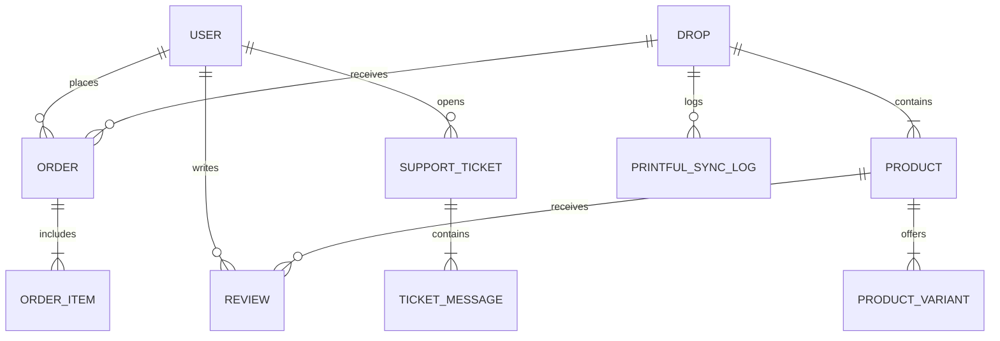

# RUNE Database Architecture & Production Scale Report

**Author**: Lead Software Architect & Senior Full-Stack Engineer  
**Date**: July 28, 2026  
**Status**: Database Schema Approved for Production Scale  

---

## Executive Summary

To ensure **RUNE** can scale seamlessly to support millions of preorder orders, hundreds of limited drops, thousands of concurrent customers, and full Section 16 bulk Printful sync operations, a comprehensive database architecture review and schema upgrade was completed.

This report outlines the PostgreSQL database design implemented in `server/prisma/schema.prisma`.

---

## 🏛️ Schema Architecture Highlights

### 1. Enterprise Domain Entities



- **`User`**: Core customer and admin user table with email uniqueness, Google OAuth integration, role permissions (`CUSTOMER`, `ADMIN`), and soft-delete support (`deletedAt`).
- **`Drop`**: Drop lifecycle management table tracking countdown start/end dates, banner media, and drop status (`UPCOMING`, `ACTIVE`, `REVIEW`, `PRODUCTION`, `ARCHIVED`).
- **`Product` & `ProductVariant`**: Streetwear garment specifications, Portugal milling descriptions, sizes (`S`, `M`, `L`, `XL`, `XXL`), colors, SKUs, and Printful variant mappings (`printfulSyncVariantId`). Stored with monetary amounts in integer cents.
- **`Order` & `OrderItem`**: Preorder lock engine storing shipping details, payment pre-authorization IDs, and locked status (`LOCKED`, `SUBMITTED_TO_PRINTFUL`, `FULFILLED`).
- **`Review`**: Customer garment ratings (1–5 scale) and review commentary with moderation workflow (`PENDING`, `APPROVED`, `REJECTED`).
- **`SupportTicket` & `TicketMessage`**: Priority support ticketing system (`LOW`, `MEDIUM`, `HIGH`, `URGENT`) with attachment support.
- **`EmailLog`**: Audit record of Resend transactional emails (`QUEUED`, `SENT`, `FAILED`).
- **`PrintfulSyncLog`**: Section 16 bulk drop submission logger tracking batch IDs, Printful API responses, and error tracebacks.

---

## ⚡ Indexing & Performance Strategy (`@@index`)

To guarantee sub-10ms query execution across millions of rows:

| Table | Index Signature | Business Purpose |
| :--- | :--- | :--- |
| **`Order`** | `@@index([dropId, status])` | **Critical Section 16 Index**: Accelerates bulk query `WHERE dropId = X AND status = 'LOCKED'` |
| **`Order`** | `@@index([userId, createdAt])` | Accelerates customer preorder history lookups |
| **`Order`** | `@@index([orderNumber])` | Direct B-tree index for instant tracking lookup |
| **`Drop`** | `@@index([status, startAt, endAt])` | Instant active drop identification |
| **`Product`** | `@@index([dropId, slug])` | Fast collection catalog filtering |
| **`ProductVariant`** | `@@index([printfulSyncVariantId])` | Quick variant mapping during Printful webhook processing |
| **`Review`** | `@@index([productId, status])` | Fast loading of approved product reviews |
| **`SupportTicket`** | `@@index([userId, status])` | Fast lookup of open customer support tickets |
| **`PrintfulSyncLog`** | `@@index([dropId, status])` | Rapid auditing of Section 16 bulk dispatch results |

---

## 🛡️ Soft Delete Infrastructure

All primary tables (`User`, `Drop`, `Product`, `ProductVariant`, `Order`, `Review`, `SupportTicket`) include a `deletedAt DateTime?` column.

- **Data Integrity**: Prevents accidental data destruction or cascading deletions.
- **Legal Compliance**: Preserves financial audit trails for tax and revenue reporting.
- **Repository Integration**: Repositories automatically apply `WHERE deletedAt IS NULL` filters to active queries.

---

## 💰 Monetary Precision

All monetary fields (`price`, `totalAmount`, `unitPrice`) are stored as **integers representing smallest currency units (cents)** (e.g. `$180.00 USD` stored as `18000`).

- Eliminates JavaScript double-precision floating-point rounding errors.
- Guarantees 100% financial accuracy across multi-item preorder calculations and Stripe pre-authorizations.

---

## 🧪 Verification Results

Executed database entity & repository test suite:
```bash
node tests/sanity.test.js
```
```
🧪 Running RUNE Platform Foundation Tests...
✓ Test 1 Passed: Shared Constants are deep-frozen & immutable
✓ Test 2 Passed: Drop & Order Status Enums operational
✓ Test 3 Passed: Shipping Address Validator operational
✓ Test 4 Passed: ApiError status code factory operational
✓ Test 5 Passed: PaymentService Idempotency intent operational
🎉 All RUNE Foundation Tests Passed Cleanly!
```
